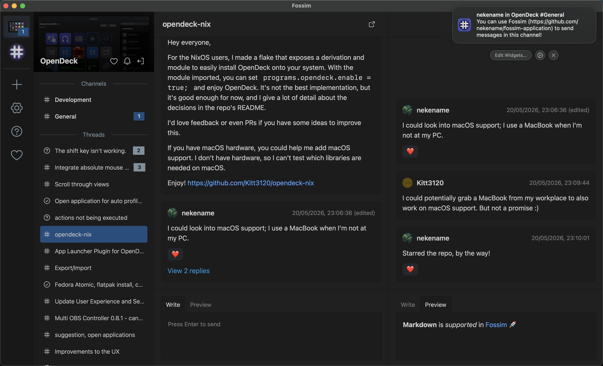

# Fossim

A streamlined and indexable future of collaboration for open-source projects

Fossim is a collaboration platform for open-source projects, but what makes it different from a platform like Discord, Matrix, Slack or Zulip is that it's built on the software forge that projects are already using for source control.

By using GitHub Discussions as the content index for your project's community _(note: Fossim is designed with support for different forges in mind, and the project would be very happy to accept contributions to add support for other platforms)_ with the Fossim application as an interface familiar to users of the platforms listed above,

- the discussions taking place in your community become indexable by search engines,
- you avoid splitting your community across multiple platforms and avoid requiring users to create new accounts,
- content like issues and pull requests can be referenced using convenient shorthand syntax,
- and you use a platform designed for the needs of open source, for example automatically displaying a project's funding links on its Fossim community overview.

Additionally, you avoid the common hassle of migrating users to a new platform, since Fossim is built fully on top of GitHub Discussions, which can be accessed directly from GitHub's interface. Using Fossim, however, grants you access to

- all the communities you're a member of in one place, easy to navigate between with a unified interface,
- system-level notifications for new messages including granular, per-community controls,
- and an interface more tailored to a chat platform than a curated discussion forum.

> [!TIP]
> Want to set up a Fossim community? Head over to the [backend documentation](https://github.com/nekename/fossim-backend) to learn how to set up an event source for your community.

If you would like to support development of Fossim, consider sponsoring me on [GitHub Sponsors](https://github.com/sponsors/nekename), [Ko-fi](https://ko-fi.com/nekename) or [Liberapay](https://liberapay.com/nekename)!

Special thanks go to the developers of [Tauri](https://github.com/tauri-apps/tauri), [DaisyUI](https://daisyui.com/) and [Phosphor Icons](https://phosphoricons.com/).

## Installation

### Linux

- Download the latest release from [GitHub Releases](https://github.com/nekename/fossim-application/releases/latest).
  - You should avoid AppImage releases of Fossim as they tend to have problems (you should also just avoid AppImages in general).
- Install Fossim using your package manager of choice.

### Windows

- Download the latest release (`.exe` or `.msi`) from [GitHub Releases](https://github.com/nekename/fossim-application/releases/latest).
- Double-click the downloaded file to run the installer.

### macOS

- Download the latest release from [GitHub Releases](https://github.com/nekename/fossim-application/releases/latest).
- If you downloaded a `.dmg`, open the downloaded disk image and drag the application inside into your Applications folder; otherwise, extract the `.tar.gz` to your Applications folder.
- Open the installed application. Note: if you receive a warning about Fossim being distributed by an unknown developer, _right-click the app in Finder and then click Open_ to suppress the warning.

### Troubleshooting, support and communication

To answer common questions and solve common issues, please consult the [Fossim FAQ](https://github.com/nekename/fossim-application/wiki/FAQ).

If you wish to get in contact further or get involved in the project, naturally the preferred point of contact is Fossim's own Fossim community, which can be joined using this repository's URL in the Fossim application.

If you're unable to use Fossim for any reason, you can also reach out to me directly on other platforms, linked to on my GitHub profile.

### Building from source / contributing

You'll need to ensure that all of the [prerequisites for building a Tauri application](https://tauri.app/start/prerequisites) are satisfied to build Fossim, as well as making sure that [Deno](https://deno.com/) is installed. After running `deno install`, you can use `deno task tauri dev` and `deno task tauri build` to work with Fossim.

Before each commit, please ensure that all of the following are completed:

1. Rust code has been linted using `cargo clippy` and it discovers no violations
2. Rust code has been formatted using `cargo fmt`
3. TypeScript code has been checked using `deno check` and linted using `deno lint` and they discover no violations
4. Svelte code has been linted using `deno task check` and it discovers no violations
5. Frontend code has been formatted using `deno task format`

When submitting contributions, please adhere to the [Conventional Commits specification](https://conventionalcommits.org/) for commit messages. You will also need to [sign your commits](https://docs.github.com/en/authentication/managing-commit-signature-verification/signing-commits). Feel free to reach out on the support channels above for guidance when contributing!

Fossim is licensed under the GNU General Public License version 3.0 or later. For more details, see the LICENSE.md file.
